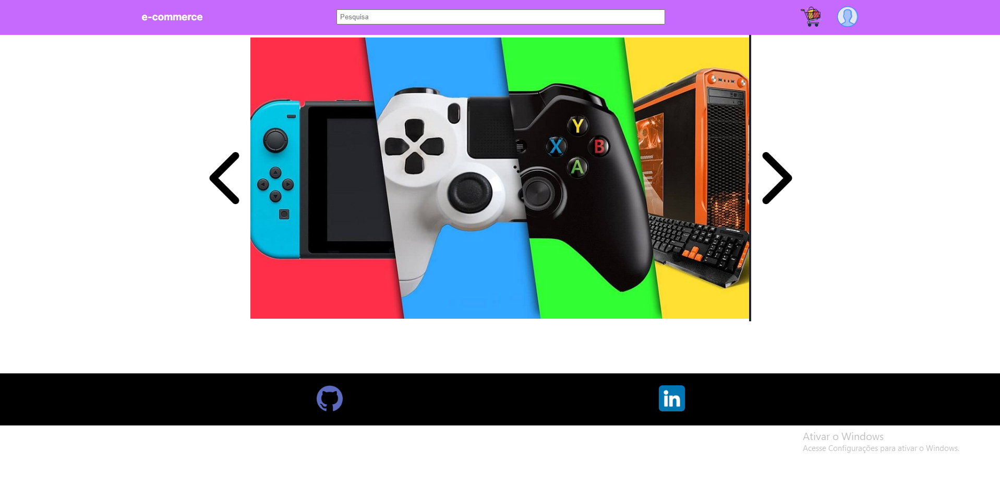

# E-commerce (front-end)

## Descrição do projeto

Esse projeto é um e-commerce fictício com funcionalidades de CRUD (create, read, update e delete), nele foi implementado funções de login, cadastro, anúncios de produtos, comentários nos produtos e carrinhos de compras.

Readme em andamento...

